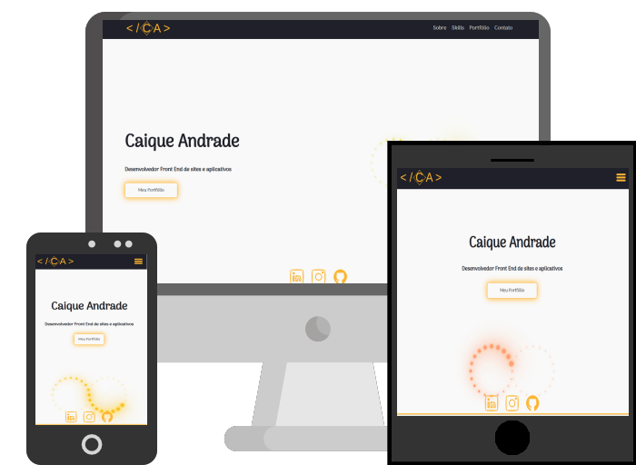

<h1 align="center">Site Portfólio</h1>

    

<h2>:rocket: Tecnologias Usadas</h2>

  
  
  

<h2>:computer: Projeto</h2>

Projeto desenvolvido para fins de estudo e como vitrine para outros projetos.  

<h2>:eyes: Deploy</h2>

Veja o projeto em [GitHub Pages](https://caiquedv.github.io/).
